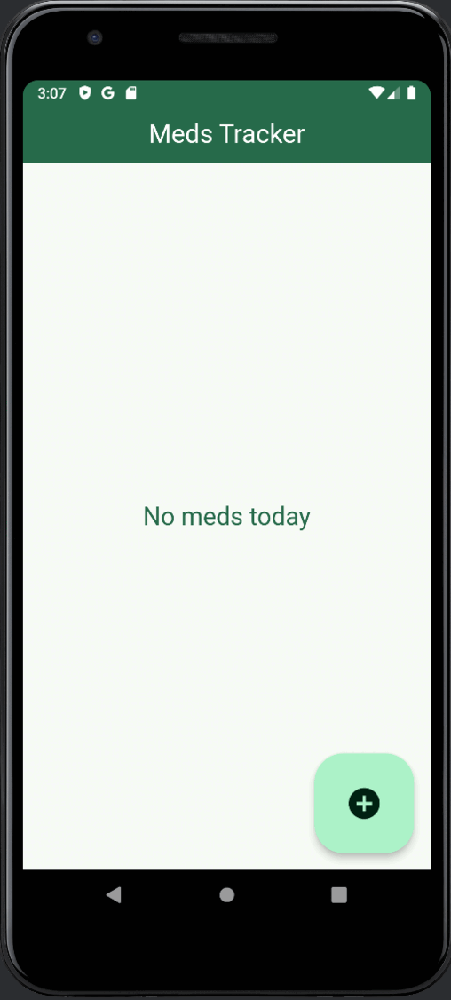

# Meds Tracker

## Overview

Meds Tracker is a Flutter application developed as a university project by Hitomi Ruoho, Matilda Lalli, and Ekaterina Korzneva at Lapland University of Applied Sciences. The application helps users manage their medications, set reminders for taking medications, and keep track of their medication history.

## Features

- **Add Medications**: Users can add new medications to their list.
- **Edit Medications**: Users can edit existing medication details.
- **Delete Medications**: Users can delete medications from their list.
- **Create Reminders**: Users can set reminders for taking medications using the `flutter_local_notifications` package, as well as reminders for recipe expiry dates.
- **Track History**: Users can keep track of their medication-taking history.

## Demo

